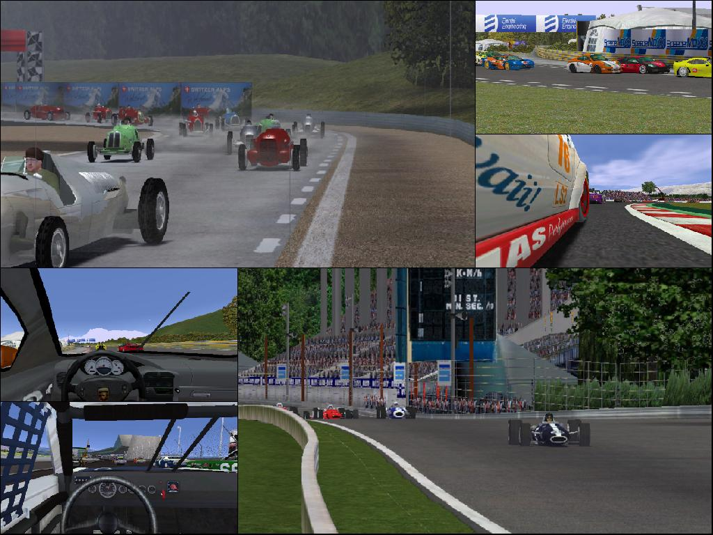

# Speed Dreams

Speed Dreams is a free and open source motorsport simulator. Originally
a fork of the [TORCS](https://torcs.sourceforge.net/) project,
it has evolved into a higher level of maturity, featuring realistic physics
with tens of high-quality cars and tracks to choose from.

> **This repository only contains the engine source code.**
> **End users are expected to download the pre-built packages listed below.**
>
> The assets repository is located on
> https://forge.a-lec.org/speed-dreams/speed-dreams-data/



## Pre-built packages

Speed Dreams binaries are available for the following platforms:

- Debian/Ubuntu (TODO)
- Microsoft Windows (TODO)

## Building from source

Speed Dreams can be built from source using the conventional build process
in CMake projects:

```
cmake -B build
cmake --build build/ # Optionally, add -j8 or any other number for faster builds
```

This assumes the
[`speed-dreams-data`](https://forge.a-lec.org/speed-dreams/speed-dreams-data/)
package is already installed on a well-known location. If not, use the
[`CMAKE_PREFIX_PATH`](https://cmake.org/cmake/help/latest/variable/CMAKE_PREFIX_PATH.html)
variable to indicate CMake where to locate an **installed** version of the
`speed-dreams-data` package:

```
cmake -B build -DCMAKE_PREFIX_PATH=<path-to-speed-dreams-data>
```

And then build the project as usual.

> If the `speed-dreams-data` package is not found, the game should still be
> able to build, but it would not be able to run.

### Dependencies

#### Debian/Ubuntu

```
sudo apt install git cmake build-essential libopenscenegraph-dev libcurl4-gnutls-dev libsdl2-dev libsdl2-mixer-dev librhash-dev libenet-dev libpng-dev libjpeg-dev zlib1g-dev libminizip-dev libopenal-dev libplib-dev libexpat1-dev libcjson-dev openjdk-17-jdk openjdk-17-jre
```

> The version for the `openjdk-*` packages might change among distributions.

## License

By default, Speed Dreams code is licensed under the GPLv2-or-later license,
as specified by the [`LICENSE`](./LICENSE) file, whereas non-functional data
is licensed under the [Free Art License](http://artlibre.org/) by default.

However, some sections of the code and some other assets are distributed under
various free (as in freedom) licenses. Please read their license files
located in their respective directories for further reference.

## Trademark disclaimer

Windows is a registered trademark of Microsoft Corporation.

Ubuntu is a registered trademark of Canonical Ltd.
